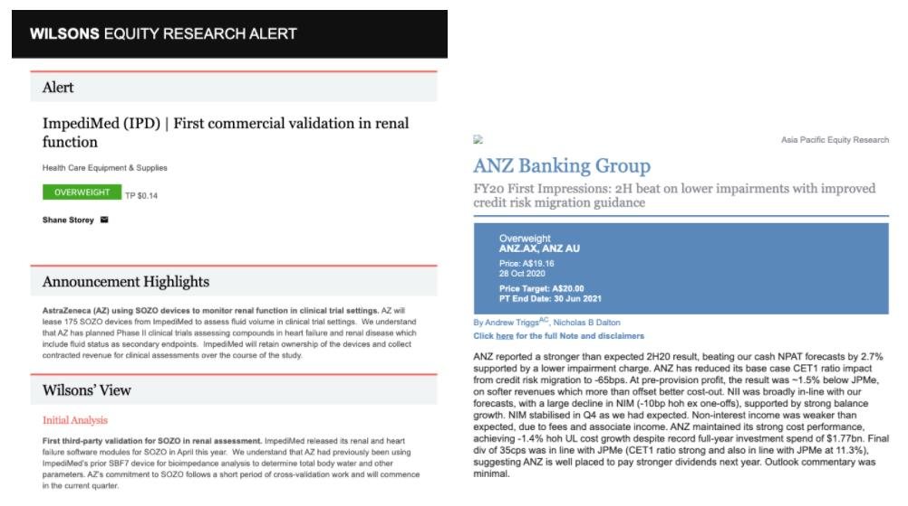
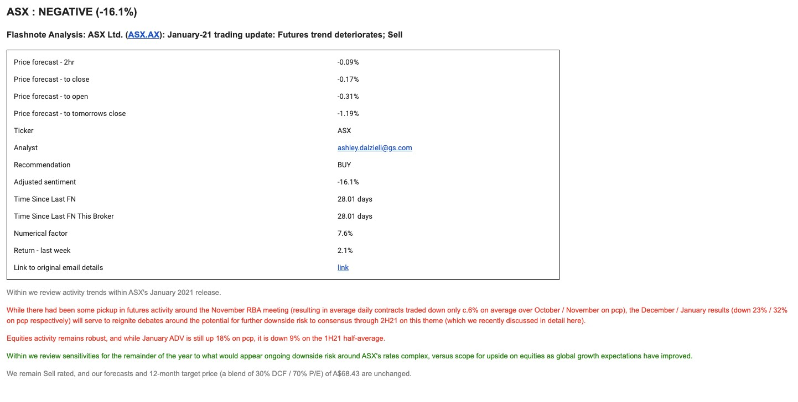
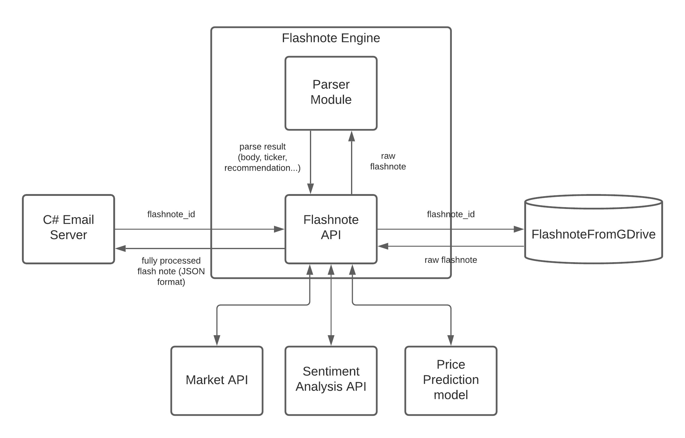
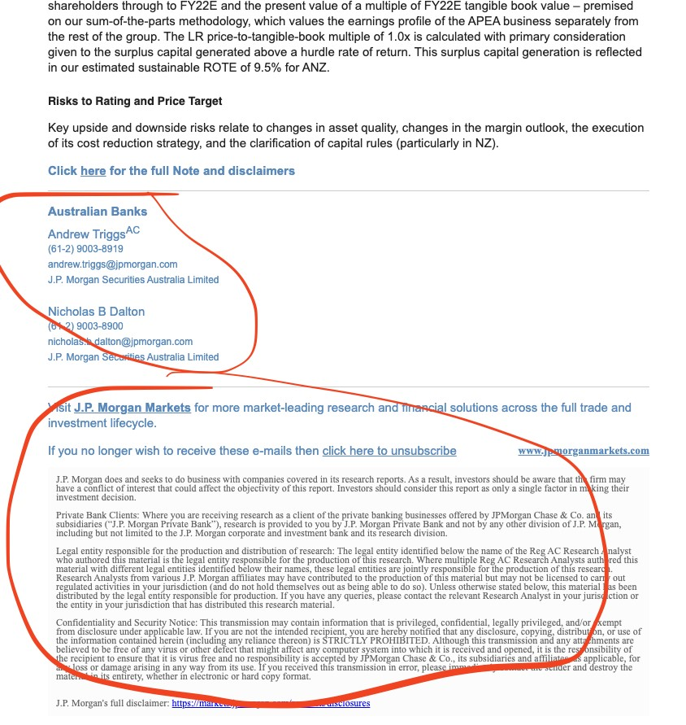
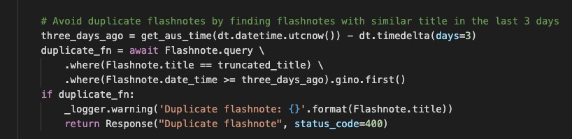
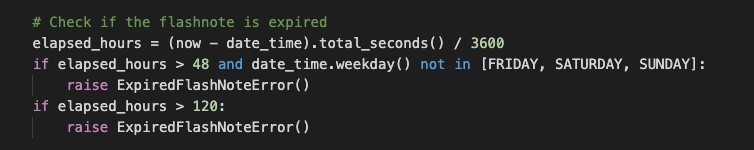

Flashnote Engine Documentation<a name="TOP"></a>
==============
 

- - - - 

## Overview

The purpose of the system is to transform the raw flash note emails in HTML format (Figure 1) from different brokers to a detailed summary (Figure 2) which contains multiple metadata such as price, prediction, sentiment analysis or ticker extraction. The main challenge is to extract the same information from different emails, as each broker uses a different format.
<br><br>

 
<p align="center">Figure 1: Example of flash note emails</p>

<br><br>

 
<p align="center">Figure 2: Example of a flash note after being processed</p>


## Mail Attribute Properties

Property                            | Description                                                               
------------------------------------|-------------------------------------------------------------------------------
Price forecast - 2hr                | Price prediction of the stock being mentioned in the next 2 hour
Price forecast - to close           | Price prediction of the stock being mentioned in the next close
Price forecast - to open            | Price prediction of the stock being mentioned in the next open
Price forecast - to tomorrow close  | Price prediction of the stock being mentioned in tomorrow close
Ticker                              | The stock being mentioned in this flash note
Analyst                             | The email of the analyst who writes the flash note
Recommendation                      | Recommendation on whether to BUY, HOLD or SELL this stock
Adjusted sentiment                  | Overall sentiment score for the document, which has been normalized by its length
Time since last FN                  | How many days since this stock has been mentioned in another flash note
Time since last FN this broker      | How many days since this stock has been mentioned in another flash note which has been sent out by the same broker
Numerical factor                    | The proportion of numerical characters in the document
Return - last week                  | Return of this stock last week

## Related Tables

- **FlashnoteFromGDrive**: The flash notes that need to be processed
	
- **FlashNoteViewModel**: The flash notes already processed and stored 
	
- **UnprocessedFlashnoteFromGDrive**: The flash notes did not processed for some reason
	
- **Tickers**: The qualified and required tickers table as ticker filter

## Table Properties

### FlashnoteFromGDrive

Property                            | Description                                                               
------------------------------------|-------------------------------------------------------------------------------
DriveId                             |unique gdrive file id for the flashnote file
FileName                            |Full file name of flashnote file
Subject                             |Extracted subject of flashnote file
Body                                |html-content body of flashnote
AccessedAt                          |the processing time of the flashnote file
TimestampAEST                       |published aest time 
TimestampUTC                        |published utc time


### FlashNoteViewModel

Property                            | Description                                                               
------------------------------------|-------------------------------------------------------------------------------
Id                                  |
Title                               |
PricePrediction                     |
Ticker                              |
Analyst                             |
NoteType                            |
DateTime                            |
ReleaseTimeCategory                 |
Recommendation                      |
RecChange                           |
Text                                |
HTMLText                            |
SourceReference                     |
AverageNumericalFactor              |
AverageWordLength                   |
AverageWordsPerSentence             |
PositiveSentences                   |
NegativeSentences                   |
NeutralSentences                    |
AverageSentiment                    |
MedianSentiment                     |
StdDevSentiment                     |
ReturnLastDay                       |
ReturnLastWeek                      |
ReturnLastMonth                     |
StdDevLastDay                       |
StdDevLastWeek                      |
StdDevLastMonth                     |
AverageDailyTurnover                |
Broker                              |
ReturnToday                         |
Return10Mins                        |
Return30Mins                        |
ReturnOneHour                       |
ReturnToClose                       |
ReturnToNextClose                   |
ReturnToNextOpen                    |
ReturnTwoHours                      |
DaysSinceLast                       |
DaysSinceLastByBroker               |
AdjustedSentiment                   |

### UnprocessedFlashnoteFromGDrive

Property                            | Description                                                               
------------------------------------|-------------------------------------------------------------------------------
DriveId                             |unique gdrive file id for the flashnote file
FileName                            |Full file name of flashnote file
Subject                             |Extracted subject of flashnote file
Body                                |html-content body of flashnote
AccessedAt                          |the processing time of the flashnote file
TimestampAEST                       |published aest time 
TimestampUTC                        |published utc time
Reason                              |the unprocessed reason (empty body; no parser; unknown ticker)

### Tickers

Property                            | Description                                                               
------------------------------------|-------------------------------------------------------------------------------
name                                | valid ticker names for regex purpose 

### Architecture

 
<p align="center">Figure 3: Application Architecture</p>

### Parser Module

Each broker will have a different Parser class, which all inherit from the BaseParser class. Depends on its parsing strategy, the broker Parser class can choose to override some of the methods in the BaseParser. The implementation detail of the BaseParser class is given below:

#### Attributes

-	**gdrive_doc**: the record of the flash note from FlashnoteFromGDrive table
-	**reliable_ticker_regexes**: a list of reliable regular expressions to extract a ticker from the flash note
-	**unreliable_ticker_regexes**: a list of unreliable regular expressions to extract a ticker from the flash note. This needs to be checked against a known set of tickers which is stored in our database
-	**subject_ticker_regexes**: a list of regular expressions to extract a ticker from the subject of the flash note email
-	**body_xpaths**: a list of XPath selectors to retrieve the body text of the email, .e.g all \<p\> tag with class name copy-body
-	**broker**: the name of the broker
  
#### Methods

-	**parse**: parse the gdrive_doc object into a ParseResult object, which contains some metadata of the flash note
- **_should_be_rejected**: returns a boolean value of whether this flash note should be rejected
-	**_extract_ticker_subject**: try to extract a ticker in the subject
-	**_extract_ticker**: try to extract a ticker from the flash note
-	**_extract_body**: extract body text from the flash note email
-	**_clean_body**: cleaning work after getting the body text
-	**_extract_analyst**: extract the analyst who writes the flash note
-	**_extract_recommendation**: extract a recommendation from the flash note
-	**_extract_date_time**: extract the time when this flash note was sent out
-	**_get_process_window**: get the process window of the current Parser class

#### Exceptions

- **OutOfProcessWindowError**: Raised when the flash note’s created time is not between the process window
- **ExpiredFlashNoteError**: Raised when the flash note is expired
- **NoParserFoundError**: Raised when we cannot find a parser for this flash note
- **RejectedError**: Raised when we want to reject this flash note for any reason

#### Creating A New Parser

-	Create a new parser class and inherit the BaseParser
-	Set the attribute **broker** and **body_xpaths**, as this is different between brokers
-	Override the methods when it’s necessary to do so
-	Add the logic to select this parser in **gdrive_parser/__init__.py**

### Rejection Rules

There are also certain rules in which we want to ignore a flash note:
- We have processed the exact same flash note in the last 3 days (based on the email subject).
- The time that this flash note was sent out is out of our processing window. The process window is different for each broker.
- The flash note has been sent out for longer than 120 hours.
- There’s a specific reason to reject the flash note. For example, with emails coming from J.P. Morgan, we want to ignore the flash notes that have “J. P. Morgan” in the subject.

### HTML Handler

#### Ticker Extraction Strategy

-	Use regular expressions to find the ticker. Example: Z1P **.AX**, APT **.ASX**
-	Try to extract a ticker from the email subject first, then the body text
-	Try to use the list of reliable tickers first, then try the unreliable one later, which needs to be checked against a list of known tickers. The table of known tickers is called **Ticker** in market_db
-	Sometimes the ticker might not be in the body text, but rather somewhere above the body text in the HTML structure; therefore, we need to look at the HTML part **before** the body text and the body text. The reason we don’t want to look further than the body text is that **the ticker of the broker** might be there, and we don’t want to mistake it for the ticker being analyzed in the flash note. In the code, this is called the **searchable_text**. An example is given below, with the **searchable_text** in **\<head\>** , **\<body\>**:

```
<html>
<head>We want this ticker APT.AX</head>
<body>
	<p>This is the body text, which does not contain a ticker</p>
</body>
<footer>
	<p>We don’t want this ticker JPM as it is the ticker of J.P. Morgan</p>
</footer>
<html>

```

#### Body Text Extraction Strategy

-	Use the **body_xpaths** attribute, which is a list of XPath selectors to grab the body text. The order of the **body_xpaths** list matters, as the parser will try the top one first.
-	Each broker will have a different format for their email, so this attribute needs to be set for each broker parser
-	When getting the body text, we don’t want to get the end part of the email, which has the details of the analysts and the disclaimer, as it can affect the quality of our sentiment analysis model. Example:

-	A way to get around this is to cut the body text when we find a phone number, an email or the word "disclaimer"


### Debugging Strategy

- If the flashnote engine miss a flash note for some reason, try to search for its subject in the **UnprocessedFlashnoteFromGDrive** table, which is where we store our unprocessed flash notes. If it’s not there, then try to search for its subject in **FlashNoteViewModel** and use its ID to call the API

- If we grab the wrong ticker for the flash note, try to debug it on your local machine by searching for its subject in the **FlashNoteViewModel** table and call the API using its ID
	- Might need to uncomment this part in **app.py** so it ignores the duplicate error
		

	- Might need to uncomment this part in the BaseParser class so it ignores the expired error
		
	  
- If we run into problems with parsing the body text of a flash note, the broker might have changed the email format. Grab that flash note and take a close look at its HTML to see if we need to add a new XPath selector to **body_xpaths**
